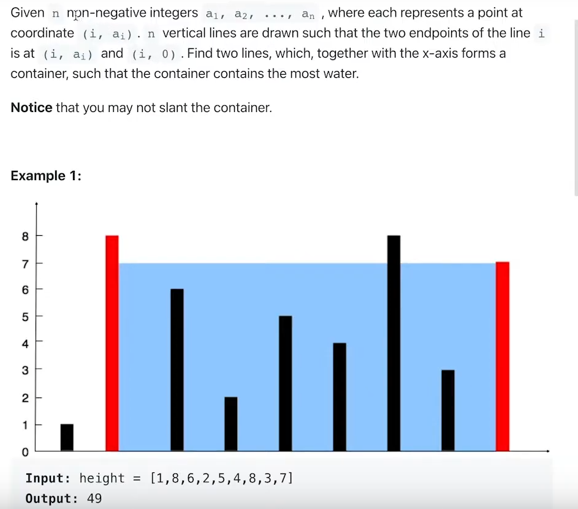

 Дано n цілих невід’ємних чисел a1, a2, ... an, де кожне
 представляє точку з координатою (i, ai). n вертикальних ліній
 проведено так, що дві кінцеві точки лінії i знаходяться в 
 (i, ai) і (i, 0). Знайдіть дві лінії, які разом з віссю х 
 утворюють ємність, у якій міститься найбільше води.

 Зауваження. Ви не можете нахиляти контейнер.
 
***********************************************************

Given n non-negative integers a1, a2, ... an, where each represents a  point at coordinate (i, ai). n vertical lines are drawn such that the two endpoints of the line i  is at (i, ai) and (i, 0). Find two lines, which, together with the x-axis forms container, such that the container contains the most water.

 Notice. that you may not slant the container.